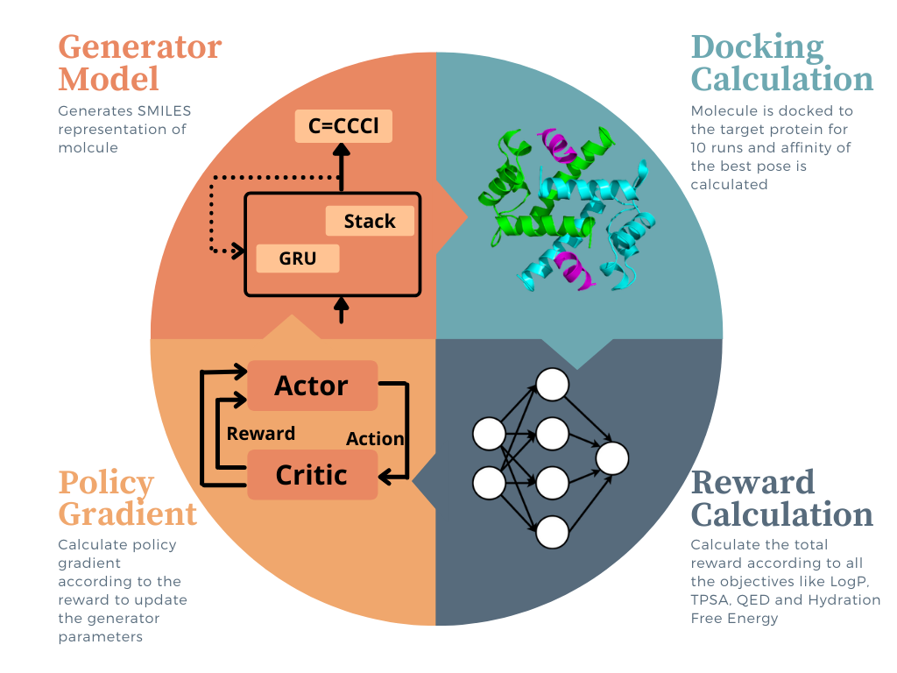

# MoleGuLAR: Molecule generation using Reinforcement Learning and Alternating Rewards
Design of new inhibitors for novel targets is a very important problem especially in the current scenario. Conventional approaches undertaken to this end like high-throughput virtual screening require extensive combing through existing datasets in the hope of finding possible matches. In this study we propose a computational strategy for de novo generation of molecules with high binding affinities to the specified target. A deep generative model is built using a stack augmented recurrent neural network for initially generating drug like molecules and then it is optimized using reinforcement learning to start generating molecules with desirable properties the most important of which is the binding affinity. The reinforcement learning section of the pipeline is further extended to multi-objective optimization showcasing the model's ability to generate molecules with a wide variety of properties desirable for drug like molecules, like, LogP, Quantitative Estimate of Drug Likeliness etc. For multi-objective optimization, we have devised a novel strategy for optimization in which the property being used to calculate the reward is changed periodically. In comparison to the conventional approach of taking a weighted sum of all rewards, this strategy has shown much better performance in it's ability to generate a significantly higher number of molecules with desirable properties.



This repository contains the code for optimization of the generator model using predictor machine learning models and docking calculations as well as other properties.

Installation
------------
[Install miniconda](https://docs.conda.io/en/latest/miniconda.html) and run the following command.

```conda env create --file environment.yml```

Running Experiments
--------------
To run the experiments that use AutoDock, AutoDock-GPU will have to be installed from [here](https://github.com/ccsb-scripps/AutoDock-GPU)

After installing AutoDock-GPU, Open the `Optimizer` directory.

To run each of the experiments run the following commands
- Single Objective: Binding Affinity with SARS-CoV-2 M<sub>pro</sub> using Docking Calculation

```python model_logP_QED_switch.py --reward_function exponential --num_iterations 175 --use_wandb yes --predictor dock --protein 6LU7 --remarks <remarks>```

- Single Objective: Binding Affinity with TTBK1 using Docking Calculation

```python model_logP_QED_switch.py --reward_function exponential --num_iterations 175 --use_wandb yes --predictor dock --protein 4BTK --remarks <remarks>```

- Single Objective: Binding Affinity with TTBK1 using GIN

```python model_logP_QED_switch.py --reward_function exponential --num_iterations 175 --use_wandb yes --predictor gin --protein 4BTK --remarks <remarks>```

- Multi Objective : Binding Affinity with SARS-CoV-2 M<sub>pro</sub> using Docking Calculation and target LogP = 2.5 (sum)

```python model_logP_QED_switch.py --reward_function exponential --num_iterations 175 --use_wandb yes --predictor dock --protein 6LU7 --remarks <remarks> --logP yes --logP_threshold 2.5 --switch no```

- Multi Objective : Binding Affinity with TTBK1 using Docking Calculation and target LogP = 2.5 (sum)

```python model_logP_QED_switch.py --reward_function exponential --num_iterations 175 --use_wandb yes --predictor dock --protein 4BTK --remarks <remarks> --logP yes --logP_threshold 2.5 --switch no```

- Multi Objective : Binding Affinity with TTBK1 using GIN and target LogP = 2.5 (sum)

```python model_logP_QED_switch.py --reward_function exponential --num_iterations 175 --use_wandb yes --predictor gin --protein 4BTK --remarks <remarks> --logP yes --logP_threshold 2.5 --switch no```

- Multi Objective : Binding Affinity with TTBK1 using GIN, target LogP = 2.5, target QED = 1, target TPSA = 100 &#8491;<sup>2</sup> and target &#916;G<sub>Hyd</sub> = -10 kcal/mol (sum)

```python model_logP_QED_switch.py --reward_function exponential --num_iterations 175 --use_wandb yes --predictor gin --protein 4BTK --remarks <remarks> --logP yes --logP_threshold 2.5 --qed yes --qed_threshold 1 --solvation yes --solvation_threshold -10 --tpsa yes --tpsa_threshold 100 --switch no```

- Multi Objective : Binding Affinity with SARS-CoV-2 M<sub>pro</sub> using Docking Calculation and target LogP = 2.5 (alternate)

```python model_logP_QED_switch.py --reward_function exponential --num_iterations 175 --use_wandb yes --predictor dock --protein 6LU7 --remarks <remarks> --logP yes --logP_threshold 2.5 --switch yes```

- Multi Objective : Binding Affinity with TTBK1 using Docking Calculation and target LogP = 2.5 (alternate)

```python model_logP_QED_switch.py --reward_function exponential --num_iterations 175 --use_wandb yes --predictor dock --protein 4BTK --remarks <remarks> --logP yes --logP_threshold 2.5 --switch yes```

- Multi Objective : Binding Affinity with TTBK1 using GIN, target LogP = 2.5 and target QED = 1 (alternate)

```python model_logP_QED_switch.py --reward_function exponential --num_iterations 175 --use_wandb yes --predictor gin --protein 4BTK --remarks <remarks> --logP yes --logP_threshold 2.5 --switch yes --qed yes --qed_threshold 1```

- Multi Objective : Binding Affinity with TTBK1 using GIN, target LogP = 6 and target QED = 1 (alternate)

```python model_logP_QED_switch.py --reward_function exponential --num_iterations 175 --use_wandb yes --predictor gin --protein 4BTK --remarks <remarks> --logP yes --logP_threshold 6 --switch yes --qed yes --qed_threshold 1```

- Multi Objective : Binding Affinity with TTBK1 using GIN and different targets of TPSA and &#916;G<sub>Hyd</sub>

```python model_hydration_tpsa_switch.py --reward_function exponential --num_iterations 175 --use_wandb yes --predictor gin --protein 4BTK --remarks <remarks> --solvation yes --tpsa yes --solvation_threshold <hydration_target> --tpsa_threshold <tpsa_target> --switch yes```

Analysis
-----------
The `Analysis/Analysis.ipynb` notebook supports loading models optimized during each experiment and generating molecules